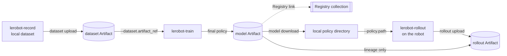

# W&B-native LeRobot pipeline (SO-101) — 日本語マニュアル


[English manual](./README.md) · 日本語

このマニュアルでは、実機で teaching dataset を記録し、その dataset を W&B Artifact として
publish し、同じ Artifact version から training を行い、学習済み policy を実機で rollout した後、
「どの policy がその rollout を生成したか」という lineage とともに結果を W&B に記録するまでの
流れを説明します。

上の図は概念図です。この fork で実装されている正確な interface は、以下の CLI command と
runtime boundary を参照してください。特に、robot の control loop 内では W&B 通信を行いません。

専門用語は CLI や W&B UI と対応しやすいように English のまま記載し、操作の意味と注意点を日本語で
説明します。この manual の command は English manual と同一です。

## Pipeline



実線は data byte の移動を表します。Registry link と policy から rollout への lineage edge は、
model byte を移動しません。

## この example の前提

- **remote store は W&B のみです。** この example から Hugging Face Hub へ push しません。
- **local disk は runtime cache と recording buffer として残ります。** Artifact は LeRobot が読む前に
  local disk へ materialize されます。
- **control loop 内では W&B を呼びません。** upload は recording や rollout の後に別 step として実行します。
- **alias は mutable、version は immutable です。** `latest` や `candidate` は移動しますが、`v3` は固定です。
- **training では実際に使用した immutable dataset version を記録します。** input に alias を使っても、
  Run には resolved version が残ります。
- **candidate や Registry link は production 承認ではありません。** 実際に評価した version に
  `production` alias を付ける操作が、明示的な promotion です。
- **rollout の成功数は operator が入力します。** physical task の成功判定は自動化していません。

## 0. Prerequisites

この fork を clone した repository root で実行してください。`your-wandb-entity` は、自分の W&B
entity に置き換えます。

以下の command は Linux の Bash-compatible shell を前提にしています。Windows PowerShell では
`.venv\Scripts\Activate.ps1` で environment を有効化し、`/dev/ttyACM*` を実機に対応する `COM` port に
置き換えてください。それ以外の CLI argument は同じです。

```bash
uv sync --locked --extra core_scripts --extra feetech --extra training
source .venv/bin/activate
wandb login
export WANDB_ENTITY="your-wandb-entity"
export WANDB_PROJECT="so101-pick-cube"
```

`core_scripts` は dataset と hardware stack、`feetech` は SO-101 の motor bus、`training` は
`wandb` と `accelerate` を導入します。以降は follower が `/dev/ttyACM0`、leader が
`/dev/ttyACM1`、OpenCV camera が index `0` にある例です。自分の hardware に合わせて変更してください。

## 1. Teaching dataset を記録する

通常の LeRobot teleoperation recording です。この時点では W&B は使用しません。

```bash
lerobot-record \
  --robot.type=so101_follower --robot.port=/dev/ttyACM0 --robot.id=my_follower \
  --teleop.type=so101_leader --teleop.port=/dev/ttyACM1 --teleop.id=my_leader \
  --robot.cameras="{ front: {type: opencv, index_or_path: 0, width: 640, height: 480, fps: 30}}" \
  --dataset.repo_id=local/pick-cube \
  --dataset.root=./data/pick-cube \
  --dataset.single_task="Pick up the cube and place it in the bin" \
  --dataset.num_episodes=30 \
  --dataset.push_to_hub=false
```

recording の途中は local disk に書き込みます。W&B を robot control の storage として直接利用する
設計ではありません。

## 2. Dataset を Artifact として publish する

W&B Run を作成する前に、local directory を検証します。metadata、Parquet schema、参照 video、index が
一致しない場合は upload を開始しません。

```bash
lerobot-wandb dataset upload \
  --root ./data/pick-cube \
  --entity "$WANDB_ENTITY" \
  --project "$WANDB_PROJECT" \
  --name pick-cube \
  --alias raw
```

command は `your-wandb-entity/so101-pick-cube/pick-cube:v0` のような immutable resolved ref を
表示します。次の training command は mutable な `raw` alias を指定しますが、W&B Run には実際に
解決された `vN` が記録されます。

## 3. Artifact から直接 training する

`dataset.repo_id` と `dataset.artifact_ref` は同時に指定できません。Artifact は dataset object の生成前に
`output_dir` 配下へ download されます。

```bash
lerobot-train \
  --dataset.artifact_ref="$WANDB_ENTITY/$WANDB_PROJECT/pick-cube:raw" \
  --policy.type=act \
  --policy.device=cuda \
  --output_dir=outputs/train/act_pick_cube \
  --job_name=act_pick_cube \
  --batch_size=8 \
  --steps=100000 \
  --wandb.enable=true \
  --wandb.project="$WANDB_PROJECT" \
  --wandb.entity="$WANDB_ENTITY" \
  --wandb.model_artifact_name=pick-cube-policy \
  --wandb.model_artifact_aliases='["candidate"]' \
  --wandb.registered_model_name=pick-cube-policy \
  --policy.push_to_hub=false
```

`wandb.model_artifact_name` は final checkpoint を versioned model Artifact として publish します。
`wandb.registered_model_name` は standalone で load できる final policy を Registry collection
`wandb-registry-model/pick-cube-policy` にも link します。

resume では、同じ `output_dir` を指定するだけではなく、保存された config を使用します。

```bash
lerobot-train --resume=true \
  --config_path=outputs/train/act_pick_cube/checkpoints/last/pretrained_model/train_config.json
```

最初に download した dataset は再利用され、sidecar に保存された identity と一致することを確認してから
training を再開します。

> **PEFT/LoRA:** adapter-only checkpoint は Artifact として upload できますが、単独では policy として
> load できないため Registry には link しません。deployment 用には merged checkpoint を publish します。

## 4. Robot machine に policy を download する

download は staging directory で行い、load 可能な policy checkpoint であることを検証した後に
`root` へ配置します。途中で失敗しても、指定した directory に不完全な policy を残しません。

```bash
lerobot-wandb model download \
  --ref "$WANDB_ENTITY/$WANDB_PROJECT/pick-cube-policy:candidate" \
  --root ./policies/pick-cube-candidate
```

command が表示した **full immutable resolved ref** をそのまま `MODEL_REF` に設定します。以下の `v0` は
例なので、実際に表示された値へ置き換えてください。

```bash
export MODEL_REF="your-wandb-entity/so101-pick-cube/pick-cube-policy:v0"
```

後から `candidate` alias が別 version を指しても、`MODEL_REF` は実際に download して使用した policy を
示し続けます。

## 5. 実機で rollout する

通常の `lerobot-rollout` です。この step は W&B に対して offline で動作します。

```bash
lerobot-rollout \
  --strategy.type=episodic \
  --policy.path=./policies/pick-cube-candidate \
  --robot.type=so101_follower --robot.port=/dev/ttyACM0 --robot.id=my_follower \
  --teleop.type=so101_leader --teleop.port=/dev/ttyACM1 --teleop.id=my_leader \
  --dataset.repo_id=local/rollout_pick-cube \
  --dataset.root=./data/rollout-pick-cube \
  --dataset.num_episodes=20 \
  --dataset.single_task="Pick up the cube and place it in the bin" \
  --dataset.push_to_hub=false
```

実行中に、task が成功した episode 数を operator が記録します。

## 6. Rollout を policy lineage とともに publish する

先に robot を切り離します。`EPISODES_SUCCEEDED` は観測した成功数へ置き換えてください。`14` は
20 episode 中 14 回成功した場合の例です。

```bash
export EPISODES_SUCCEEDED="14"

lerobot-wandb rollout upload \
  --root ./data/rollout-pick-cube \
  --entity "$WANDB_ENTITY" \
  --project "$WANDB_PROJECT" \
  --name pick-cube-rollout \
  --model-ref "$MODEL_REF" \
  --episodes-succeeded "$EPISODES_SUCCEEDED"
```

`candidate` ではなく immutable な `MODEL_REF` を渡します。upload 時に alias を再解決すると、rollout の
途中で alias が移動した場合、実際に robot が使用していない policy を lineage に記録する危険があります。

upload Run は policy を input lineage edge として参照し、model byte を再 download しません。rollout は
training dataset と区別された `rollout` Artifact として publish されます。episode 数、成功数、success rate、
frame 数、duration、requested/resolved policy ref、代表 video が記録され、完全な rollout data は Artifact に
保存されます。

> **代表 video について:** Dataset v3 では、1 つの `.mp4` に file-size target の範囲で複数 episode が
> 連結される場合があります。そのため W&B UI に表示される clip は単一 episode とは限りません。対象の
> episode は Run summary の `representative_video_episodes` に記録されます。

## 7. 評価済み policy を promote する

rollout で評価した **同じ immutable version** を promote します。download 済み directory を再 upload すると
新しい version が作られ、評価 Run との lineage が分離するため使用しません。

```bash
lerobot-wandb model promote \
  --ref "$MODEL_REF" \
  --alias production \
  --registry-collection pick-cube-policy
```

`model promote` は model byte を upload せず、既存 version の alias と Registry link を更新します。
model Artifact ではない ref、weight のみの periodic checkpoint、adapter-only policy は deployable な Registry
entry として拒否されます。

Registry link は project alias を移動する前に試行されます。2 つの server-side write をまとめる transaction は
ないため、この順序にすることで Registry link が失敗した場合でも `production` alias は変更されません。
rollout の結果が promotion に十分かどうかは operator が Run を確認して判断します。

## 保存先と lineage

| 対象                             | 保存先                                                  |
| -------------------------------- | ------------------------------------------------------- |
| Teaching dataset                 | `dataset` Artifact の `pick-cube`                       |
| Trained policy                   | `model` Artifact の `pick-cube-policy` と Registry link |
| Rollout episodes                 | `rollout` Artifact の `pick-cube-rollout`               |
| Dataset から policy への lineage | training Run config と model Artifact metadata          |
| Policy から rollout への lineage | rollout Run input edge と rollout Artifact metadata     |

この workflow の目的は単なる file storage ではなく、dataset、training、physical rollout、promotion を
immutable version と lineage で接続し、後から判断根拠を再現できる状態にすることです。
