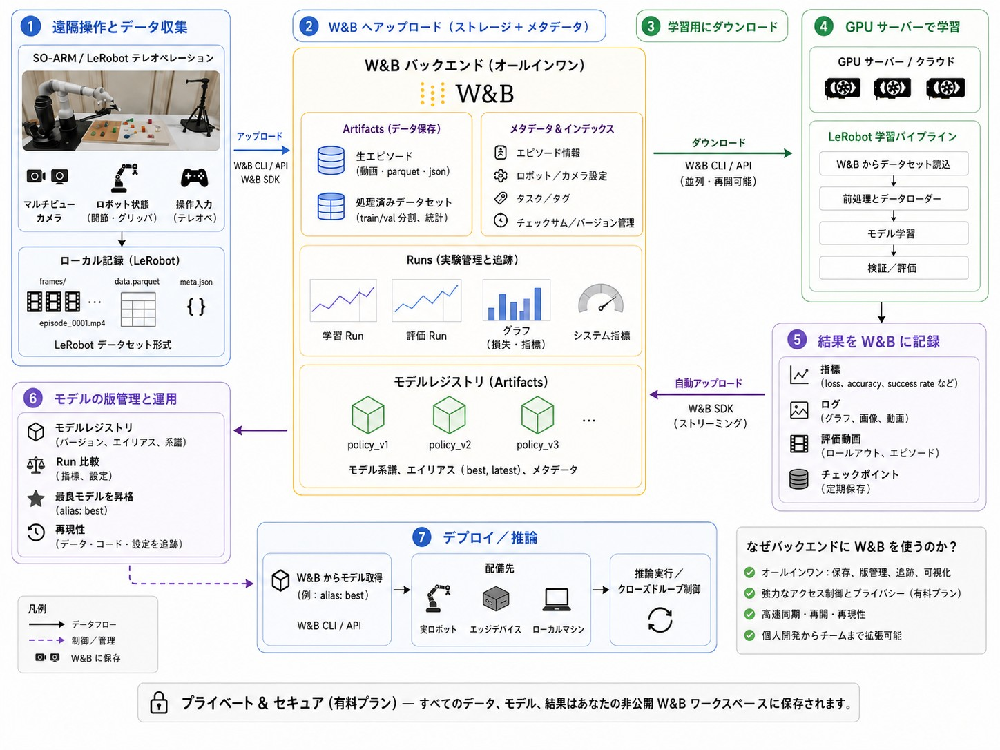
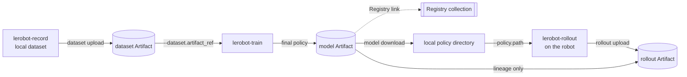

# LeRobot と W&B companion (SO-101) — fork の旧 manual（日本語）



この画像は LeRobot × W&B ecosystem の広い全体像を示すもので、`lerobot-wandb` の capability
contract ではありません。**Auto-Upload**、**W&B SDK (Streaming)**、**Deploy / Inference**、
**Closed-Loop Control**、「すべてのデータ、model、結果を private W&B workspace に保存する」といった
表示は、upstream の optional 設定、fork の過去の hook、外部 deployment の文脈です。この companion
contract の範囲は、通常の LeRobot command の前後で明示的に行う Artifact transfer と promotion です。
`lerobot-record`、`lerobot-train`、`lerobot-rollout` の実行は LeRobot が担当します。data の自動記録、
全 Run の streaming、model の自動 deploy、すべての data の W&B 保存、robot control loop の引き取りは
行いません。

[English manual](./README.md) · 日本語

この manual では、実機で dataset を記録し、W&B Artifact に保存した immutable version から学習します。
学習した policy を実機で rollout し、その policy と結果を lineage で結び付けて W&B に記録するまでの
流れを説明します。

> [!NOTE]
> **このファイルは fork 用のレガシー版 manual です。** 現在の companion manual は [English manual](https://github.com/guchengwei/lerobot-wandb/blob/main/MANUAL.md) と
> [日本語 manual](https://github.com/guchengwei/lerobot-wandb/blob/main/MANUAL.ja.md) です。このファイルには fork 専用の training path を残しています。
> `lerobot-wandb` は、通常の upstream LeRobot と一緒に動く W&B companion/integration です。package の source とリリースは LeRobot とは別に管理されていますが、LeRobot の replacement や native plugin contract ではなく、これだけで完結する product でもありません。
> PyPI にはまだ公開されていないため、source から `pip install "lerobot-wandb @ git+https://github.com/guchengwei/lerobot-wandb.git@main"` で導入します。
> 以下に示す `--dataset.artifact_ref` を使う training、training 中の Artifact materialization、W&B の model publication 用 config field、同じ Run での final-model publication は fork 専用 hook です。
> `lerobot-record` と `lerobot-rollout` は通常の LeRobot command のままです。companion の現在の使い方は、上の manual を参照してください。

上の図は概念図です。以下の command と runtime boundary は、この fork の現在の構成を説明するものです。
特に、robot の control loop 内では W&B 通信を行いません。

専門用語は CLI や W&B UI と対応しやすいように English のまま記載し、操作の意味と注意点を日本語で
説明します。ここに示す command は English manual と同一です。

## 処理の流れ



実線は data byte の移動を表します。Registry link と policy から rollout への lineage edge は
model byte を移動しません。

`--dataset.artifact_ref` の edge と final-model publication は fork 専用の training hook です。
`lerobot-record` と `lerobot-rollout` は通常の upstream LeRobot command です。companion はその前後で
Artifact transfer を明示的に行います。

## この例の前提

- **remote store は W&B のみです。** この例から Hugging Face Hub へ push しません。
- **local disk は recording buffer と runtime cache です。** Artifact download の内容は LeRobot が読む
  前に local disk へ materialize されます。この fork の `--dataset.artifact_ref` training hook では
  `output_dir` 配下に dataset を materialize します。
- **control loop 内では W&B を呼びません。** upload は recording や rollout の後に別 step で行います。
- **alias は mutable、version は immutable です。** `latest` や `candidate` は移動しますが、`v3` は固定です。
- **training では実際に使用した immutable dataset version を記録します。** input に alias を使っても、
  Run には resolved version が残ります。
- **candidate や Registry link は production 承認ではありません。** 実際に評価した version に
  `production` alias を付ける操作が、明示的な promotion です。
- **rollout の成功数は operator が入力します。** physical task の成功判定は自動化していません。

## 0. 前提条件

この fork を clone した repository の root で実行してください。`your-wandb-entity` は自分の W&B
entity に置き換えます。

以下の command は Linux の Bash-compatible shell を前提にしています。Windows PowerShell では
`.venv\Scripts\Activate.ps1` で environment を有効化し、`/dev/ttyACM*` を実機に対応する `COM` port に
置き換えてください。それ以外の CLI argument は同じです。

### 0.1 fork の開発環境（この旧 manual の実行方法）

fork の training integration（`lerobot-train --dataset.artifact_ref`、final model publication）
には fork 本体が必要です。`training` extra は companion distribution `lerobot-wandb` を自動で
導入します。

```bash
uv sync --locked --extra core_scripts --extra feetech --extra training
source .venv/bin/activate
wandb login
export WANDB_ENTITY="your-wandb-entity"
export WANDB_PROJECT="so101-pick-cube"
```

`core_scripts` は dataset と hardware stack、`feetech` は SO-101 の motor bus、`training` は
`wandb` と `accelerate`、そして companion の `lerobot-wandb` を導入します。以降は follower が
`/dev/ttyACM0`、leader が `/dev/ttyACM1`、OpenCV camera が index `0` にある例です。自分の
hardware に合わせて変更してください。

### 0.2 既存の LeRobot 環境に companion を導入する

`lerobot-wandb` は、すでに導入されている通常の upstream LeRobot（または互換 fork）に追加して使う
companion/integration です。既存の LeRobot を置き換えたり shadow したりせず、`lerobot` namespace に
file を配置しません。PyPI にはまだ公開されていないため、source から導入します。

```bash
# Existing LeRobot environment:
pip install "lerobot-wandb @ git+https://github.com/guchengwei/lerobot-wandb.git@main"

# Fresh environment with a compatible LeRobot:
pip install "lerobot-wandb[lerobot] @ git+https://github.com/guchengwei/lerobot-wandb.git@main"
```

公開後は PyPI の install command に切り替わります。

この manual の fork 専用 hook は training step（§3）で、同じ Run からの final-model publication もここで
行います。dataset、model、rollout の Artifact transfer と promotion は、通常の upstream LeRobot と
組み合わせて使えます。companion が必要とする LeRobot の対応 range は `>=0.6.1,<0.6.2` です。
LeRobot が必要な command は起動時に導入 version を検証し、
LeRobot が無い・非対応の場合は actionable message で失敗します（`--allow-unsupported-lerobot` が
実験的な override です）。

## 1. データセットを記録する

これは通常の LeRobot による teleoperation recording です。この時点では W&B は関与しません。

```bash
lerobot-record \
  --robot.type=so101_follower --robot.port=/dev/ttyACM0 --robot.id=my_follower \
  --teleop.type=so101_leader --teleop.port=/dev/ttyACM1 --teleop.id=my_leader \
  --robot.cameras="{ front: {type: opencv, index_or_path: 0, width: 640, height: 480, fps: 30}}" \
  --dataset.repo_id=local/pick-cube \
  --dataset.root=./data/pick-cube \
  --dataset.single_task="Pick up the cube and place it in the bin" \
  --dataset.num_episodes=30 \
  --dataset.push_to_hub=false
```

recording 中は local disk に書き込みます。robot control の storage として W&B を直接使う構成では
ありません。

## 2. Dataset を Artifact として保存する

W&B Run を作成する前に local directory を検証します。metadata、Parquet schema、参照 video、index が
一致しない場合は upload を始めません。

```bash
lerobot-wandb dataset upload \
  --root ./data/pick-cube \
  --entity "$WANDB_ENTITY" \
  --project "$WANDB_PROJECT" \
  --name pick-cube \
  --alias raw
```

command は `your-wandb-entity/so101-pick-cube/pick-cube:v0` のような immutable resolved ref を
表示します。次の training command では mutable な `raw` alias を指定しますが、W&B Run には実際に
解決された `vN` が記録されます。

Run Media で episode ごとに確認するには `--preview-episode N` を繰り返し指定するか、`--preview-all` で
すべての episode と camera の review media を保存します。v3 dataset では episode metadata の
timestamp を使い、共有 video chunk から各 episode だけを review media として切り出します。Artifact
内の元 video byte は変更しません。all-episode mode の上限は既定で 50 episode です。より大きい
dataset では Run 作成前に失敗するため、追加の upload cost を許容する場合だけ
`--preview-max-episodes N` で上限を明示的に引き上げてください。review media が不要なら
`--no-preview` を指定します。

## 3. Artifact から直接学習する（fork 専用 hook）

これは upstream companion contract ではなく、この fork が提供する training composition です。
`dataset.repo_id` と `dataset.artifact_ref` は同時に指定できません。fork は dataset object を作る前に
Artifact を `output_dir` 配下へ materialize し、requested ref と resolved `vN` の両方を Run に記録します。
`--wandb.model_artifact_name`、`--wandb.model_artifact_aliases`、`--wandb.registered_model_name` は
同じ training Run から final model を保存するための W&B config field であり、これらも fork 専用です。

```bash
lerobot-train \
  --dataset.artifact_ref="$WANDB_ENTITY/$WANDB_PROJECT/pick-cube:raw" \
  --policy.type=act \
  --policy.device=cuda \
  --output_dir=outputs/train/act_pick_cube \
  --job_name=act_pick_cube \
  --batch_size=8 \
  --steps=100000 \
  --wandb.enable=true \
  --wandb.project="$WANDB_PROJECT" \
  --wandb.entity="$WANDB_ENTITY" \
  --wandb.model_artifact_name=pick-cube-policy \
  --wandb.model_artifact_aliases='["candidate"]' \
  --wandb.registered_model_name=pick-cube-policy \
  --policy.push_to_hub=false
```

`wandb.model_artifact_name` は final checkpoint を versioned model Artifact として保存します。
`wandb.registered_model_name` はそのまま load できる final policy を Registry collection
`wandb-registry-model/pick-cube-policy` にも link します。

resume では、同じ `output_dir` を指定するだけではなく、保存された config を使用します。

```bash
lerobot-train --resume=true \
  --config_path=outputs/train/act_pick_cube/checkpoints/last/pretrained_model/train_config.json
```

最初に download した dataset は再利用され、sidecar に保存された identity と一致することを確認してから
training を再開します。

> **PEFT/LoRA:** adapter-only checkpoint は Artifact として upload できますが、それだけでは policy として
> load できません。そのため Registry には link せず、deployment 用には merged checkpoint を保存します。

## 4. robot machine に policy を取得する

download は staging directory で行い、必要な policy file と config が揃っていることを確認した後に
`root` へ配置します。weight は load も execute もしません。途中で失敗しても、指定した directory に
不完全な policy を残しません。

```bash
lerobot-wandb model download \
  --ref "$WANDB_ENTITY/$WANDB_PROJECT/pick-cube-policy:candidate" \
  --root ./policies/pick-cube-candidate
```

command が表示した **full immutable resolved ref** をそのまま `MODEL_REF` に設定します。以下の `v0` は
例なので、実際に表示された値へ置き換えてください。

```bash
export MODEL_REF="your-wandb-entity/so101-pick-cube/pick-cube-policy:v0"
```

後から `candidate` alias が別 version を指しても、`MODEL_REF` は実際に download して使用した policy を
示し続けます。

## 5. 実機で rollout する

通常の `lerobot-rollout` を実行します。この step は W&B から切り離されています。

```bash
lerobot-rollout \
  --strategy.type=episodic \
  --policy.path=./policies/pick-cube-candidate \
  --robot.type=so101_follower --robot.port=/dev/ttyACM0 --robot.id=my_follower \
  --teleop.type=so101_leader --teleop.port=/dev/ttyACM1 --teleop.id=my_leader \
  --dataset.repo_id=local/rollout_pick-cube \
  --dataset.root=./data/rollout-pick-cube \
  --dataset.num_episodes=20 \
  --dataset.single_task="Pick up the cube and place it in the bin" \
  --dataset.push_to_hub=false
```

実行中に成功した episode 数を operator が記録します。

## 6. rollout と policy の lineage を W&B に保存する

先に robot を切り離します。`EPISODES_SUCCEEDED` は実際の成功数に置き換えてください。`14` は
20 episode 中 14 回成功した場合の例です。

```bash
export EPISODES_SUCCEEDED="14"

lerobot-wandb rollout upload \
  --root ./data/rollout-pick-cube \
  --entity "$WANDB_ENTITY" \
  --project "$WANDB_PROJECT" \
  --name pick-cube-rollout \
  --model-ref "$MODEL_REF" \
  --episodes-succeeded "$EPISODES_SUCCEEDED"
```

`candidate` ではなく immutable な `MODEL_REF` を渡します。upload 時に alias を再解決すると、rollout の
途中で alias が移動した場合、robot が実際に使っていない policy を lineage に記録する危険があります。

upload Run は policy を input lineage edge として参照し、model byte を再 download しません。rollout は
training dataset とは別の `rollout` Artifact として保存されます。episode 数、成功数、success rate、
frame 数、duration、requested/resolved policy ref が記録されます。完全な rollout data は **元の
encoding のまま** Artifact に保存されます（LeRobot の既定 video codec は AV1 です）。

> **代表 video について:** 代表 clip は決定的に選択され、追加コマンドなしで browser 互換の
> H.264/yuv420p preview に transcode され、Run media として自動記録されます。この preview は表示用の
> 派生 data に過ぎず、Artifact には含まれず、学習 data として使うべきものではありません。Dataset v3
> では、1 つの `.mp4` に file-size target の範囲で複数 episode が連結される場合があります。そのため
> W&B UI に表示される clip は単一 episode とは限りません。対象の episode は Run summary の
> `representative_video_episodes` に記録されます。

## 7. 評価済み policy を promote する

rollout で評価した **同じ immutable version** を promote します。download 済み directory を再 upload すると、
評価 Run と lineage がつながらない新しい version になるため、再 upload は行いません。

```bash
lerobot-wandb model promote \
  --ref "$MODEL_REF" \
  --alias production \
  --registry-collection pick-cube-policy
```

`model promote` は model byte を upload せず、既存 version の alias と Registry link を更新します。
model Artifact ではない ref、weight だけの periodic checkpoint、adapter-only policy は deployable な
Registry entry として拒否されます。

Registry link は project alias を移動する前に試行されます。2 つの server-side write をまとめる transaction は
ないため、Registry link が失敗してもこの順序なら `production` alias は変更されません。
rollout の結果が promotion に十分かどうかは operator が Run を確認して判断します。

## 保存先と lineage

| 対象                             | 保存先                                                  |
| -------------------------------- | ------------------------------------------------------- |
| 記録した dataset                 | `dataset` Artifact の `pick-cube`                       |
| 学習済み policy                  | `model` Artifact の `pick-cube-policy` と Registry link |
| rollout の episode               | `rollout` Artifact の `pick-cube-rollout`               |
| dataset から policy への lineage | training Run config と model Artifact metadata          |
| policy から rollout への lineage | rollout Run input edge と rollout Artifact metadata     |

この workflow は単なる file storage ではありません。dataset、training、physical rollout、promotion を
immutable version と lineage でつなぎ、後から判断の根拠を追えるようにします。

## 8. W&B integration を削除 / uninstall する

companion を直接 install した場合（この fork に埋め込まれていた companion を以前直接 install した場合を
含む）は、package manager で distribution を削除します。これは package の削除であり、workflow data の
cleanup ではありません。

```bash
python -m pip uninstall lerobot-wandb
```

uv-managed environment では次を使います。

```bash
uv pip uninstall lerobot-wandb
```

companion を削除しても、LeRobot、local dataset、download/materialize 済み model、rollout directory、
training output、`.wandb_artifact.json` などの workflow metadata、W&B credential/configuration、
remote W&B Artifact/Run/Registry object/alias、共有 Python dependency は削除されません。

この fork workspace を `--extra training` で sync した場合、上の一度だけの uv uninstall を永続的な
解除方法として扱わないでください。`training` の選択を止め、W&B を含まない training component を
直接 sync します（必要に応じて `feetech` は利用する hardware extra に置き換えます）。

```bash
uv sync --locked \
  --extra core_scripts \
  --extra feetech \
  --extra dataset \
  --extra accelerate-dep
```

companion が無くなり、通常の LeRobot training が残っていることを確認します。

```bash
uv pip show lerobot-wandb
.venv/bin/lerobot-train --help
```

最初の command は `lerobot-wandb` が未導入であることを示し、2 つ目は引き続き成功するはずです。
後から `--extra training` を選んで sync すると、integration は設計どおり再導入されます。generic な
`wandb` library は別の selected dependency が必要とする場合には残ることがあります。
