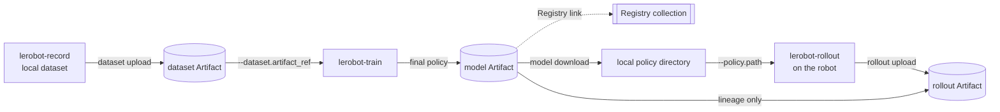

# W&B-native LeRobot pipeline (SO-101)


[English] · [日本語マニュアル](./README.ja.md)

Record on a real robot, publish the dataset, train from that exact dataset version, publish the
trained policy, roll it out on the robot, and publish the rollout with a lineage edge back to the
model that produced it — with W&B as the only remote store.

The diagram is a conceptual overview. The commands and runtime boundaries below are the
authoritative interface for this fork. In particular, W&B is never called from the robot control
loop.

The commands form a tested template. Supply the setup and runtime values explicitly marked in steps
0, 4, and 6, and adjust the hardware ports and camera index described in step 0.
`tests/integrations/wandb_artifacts/test_showcase_readme.py` expands the documented values, extracts
the commands, and parses them against the real CLI. It does not exercise a live W&B workspace or
robot hardware.

## Pipeline



Solid arrows move bytes. The Registry link and the policy-to-rollout lineage edge do not.

## What this example is and is not

Read this before the commands; it is the part that keeps you from being misled.

- **W&B is the only remote store here.** Nothing in this example pushes to the Hugging Face Hub.
  `lerobot-wandb` never touches the Hub.
- **Local disk stays the runtime cache and recording buffer.** Artifacts are materialized to disk
  before anything reads them. W&B is a durable store for finished artifacts, not a filesystem the
  robot reaches through.
- **No W&B call happens inside the robot control loop.** Publishing is a separate step you run after
  recording or rollout, with the robot disconnected.
- **Aliases are mutable; versions are immutable.** `latest` and `candidate` can move; `v3` cannot.
- **Training records the immutable version it actually trained on.** You may pass a mutable alias;
  the Run records the resolved `vN`, so it remains reproducible after the alias moves.
- **A candidate or Registry link is not production approval.** Applying `production` to the exact
  evaluated version is the deliberate promotion step.
- **Rollout success counts are supplied by the operator.** Nothing here scores physical success
  automatically; pass the count from your own judgement.

## 0. Prerequisites

Run this from the root of a clone of this fork. Replace `your-wandb-entity` with the W&B entity that
owns the project.

The worked commands target Linux with a Bash-compatible shell. On Windows PowerShell, activate the
environment with `.venv\Scripts\Activate.ps1` and replace `/dev/ttyACM*` device paths with the
corresponding `COM` ports. The remaining CLI arguments are the same.

```bash
uv sync --locked --extra core_scripts --extra feetech --extra training
source .venv/bin/activate
wandb login
export WANDB_ENTITY="your-wandb-entity"
export WANDB_PROJECT="so101-pick-cube"
```

`core_scripts` installs the dataset and hardware stacks, `feetech` the SO-101 motor bus, and
`training` both `wandb` and `accelerate`. The commands below assume an SO-101 follower on
`/dev/ttyACM0`, a leader on `/dev/ttyACM1`, and an OpenCV camera at index `0`; adjust them to your
hardware.

## 1. Record a teaching dataset

This is standard LeRobot recording. W&B is not involved yet.

```bash
lerobot-record \
  --robot.type=so101_follower --robot.port=/dev/ttyACM0 --robot.id=my_follower \
  --teleop.type=so101_leader --teleop.port=/dev/ttyACM1 --teleop.id=my_leader \
  --robot.cameras="{ front: {type: opencv, index_or_path: 0, width: 640, height: 480, fps: 30}}" \
  --dataset.repo_id=local/pick-cube \
  --dataset.root=./data/pick-cube \
  --dataset.single_task="Pick up the cube and place it in the bin" \
  --dataset.num_episodes=30 \
  --dataset.push_to_hub=false
```

## 2. Publish the dataset as an Artifact

The directory is fully validated locally before a W&B Run is created: metadata must parse, Parquet
must match the declared schema, referenced videos must exist, and indices must agree. A malformed
dataset costs you no Run and no upload.

```bash
lerobot-wandb dataset upload \
  --root ./data/pick-cube \
  --entity "$WANDB_ENTITY" \
  --project "$WANDB_PROJECT" \
  --name pick-cube \
  --alias raw
```

The command prints an immutable resolved reference such as
`your-wandb-entity/so101-pick-cube/pick-cube:v0`. W&B records that resolved version when training
starts, even though the next command requests the mutable `raw` alias.

## 3. Train directly from the Artifact

Exactly one of `dataset.repo_id` and `dataset.artifact_ref` may be set. The Artifact is materialized
under `output_dir` before any dataset object is built, and the Run records both the requested ref and
the resolved `vN`.

```bash
lerobot-train \
  --dataset.artifact_ref="$WANDB_ENTITY/$WANDB_PROJECT/pick-cube:raw" \
  --policy.type=act \
  --policy.device=cuda \
  --output_dir=outputs/train/act_pick_cube \
  --job_name=act_pick_cube \
  --batch_size=8 \
  --steps=100000 \
  --wandb.enable=true \
  --wandb.project="$WANDB_PROJECT" \
  --wandb.entity="$WANDB_ENTITY" \
  --wandb.model_artifact_name=pick-cube-policy \
  --wandb.model_artifact_aliases='["candidate"]' \
  --wandb.registered_model_name=pick-cube-policy \
  --policy.push_to_hub=false
```

`wandb.model_artifact_name` publishes the final checkpoint as its own versioned model Artifact,
separate from periodic per-checkpoint uploads. `wandb.registered_model_name` additionally links a
deployable final policy into the Registry collection `wandb-registry-model/pick-cube-policy`.

Resuming works without downloading the dataset again. Resume with the saved config, not
`output_dir` alone:

```bash
lerobot-train --resume=true \
  --config_path=outputs/train/act_pick_cube/checkpoints/last/pretrained_model/train_config.json
```

The already-materialized dataset under the original Run's `output_dir` is reused, and its identity
is checked against the sidecar written by the first download before training resumes.

> **PEFT/LoRA:** an adapter-only checkpoint is uploaded but is not linked into the Registry. Its
> base model is read verbatim from `adapter_config.json` at load time and is never rebased on the
> downloaded directory, so the Artifact cannot be rolled out on its own. The refusal reason is
> recorded as `registry_link_refused_reason`. Publish a merged checkpoint for deployment.

## 4. Fetch the trained policy on the robot machine

The command downloads transactionally into a staging directory, validates that the result is a
loadable policy checkpoint, and only then moves it to `root`. An interrupted or invalid download
does not leave a half-written policy at the destination.

```bash
lerobot-wandb model download \
  --ref "$WANDB_ENTITY/$WANDB_PROJECT/pick-cube-policy:candidate" \
  --root ./policies/pick-cube-candidate
```

Copy the full immutable resolved reference printed by the command into `MODEL_REF`. Replace the
example; do not infer a version number from the alias.

```bash
export MODEL_REF="your-wandb-entity/so101-pick-cube/pick-cube-policy:v0"
```

The resulting directory is usable directly as `policy.path`. `candidate` may move later;
`MODEL_REF` must continue to identify the policy that was actually downloaded and run.

## 5. Roll out on the real robot

This is standard `lerobot-rollout` and is offline with respect to W&B. The `rollout_` prefix on the
dataset name is required by the rollout config.

```bash
lerobot-rollout \
  --strategy.type=episodic \
  --policy.path=./policies/pick-cube-candidate \
  --robot.type=so101_follower --robot.port=/dev/ttyACM0 --robot.id=my_follower \
  --teleop.type=so101_leader --teleop.port=/dev/ttyACM1 --teleop.id=my_leader \
  --dataset.repo_id=local/rollout_pick-cube \
  --dataset.root=./data/rollout-pick-cube \
  --dataset.num_episodes=20 \
  --dataset.single_task="Pick up the cube and place it in the bin" \
  --dataset.push_to_hub=false
```

Count successful episodes while the rollout runs. You will supply that number in the next step.

## 6. Publish the rollout with policy lineage

Disconnect the robot first; this step is pure upload. Set `EPISODES_SUCCEEDED` to the observed
count. `14` is only an example for a 20-episode rollout.

```bash
export EPISODES_SUCCEEDED="14"

lerobot-wandb rollout upload \
  --root ./data/rollout-pick-cube \
  --entity "$WANDB_ENTITY" \
  --project "$WANDB_PROJECT" \
  --name pick-cube-rollout \
  --model-ref "$MODEL_REF" \
  --episodes-succeeded "$EPISODES_SUCCEEDED"
```

Use the immutable `MODEL_REF`, not `candidate`. The ref is resolved again at upload time, so an alias
that moved in between could record a policy the robot never used. Recording the wrong model is worse
than recording nothing because the lineage looks authoritative.

The upload Run declares the model as an **input** — resolved for lineage and never downloaded — and
the rollout as an **output** of type `rollout`, distinct from a training dataset. It logs episode
count, success count and rate, frame count, duration, and requested and resolved model refs. The
complete rollout remains in the Artifact with its **original encoding unchanged** (the default
LeRobot video codec is AV1).

> **About the representative video:** one clip is selected deterministically and, with no extra
> command, transcoded to a browser-compatible H.264/yuv420p preview that is logged automatically as
> run media. That preview is a _display derivative only_ — it is never part of the Artifact, and it
> is not the data anything should train on. In Dataset v3, a single `.mp4` may contain as many
> episodes as fit under the writer's file-size target, so the UI clip can represent an episode
> span. The Run summary records the included episodes under `representative_video_episodes`.

## 7. Promote what worked

Nothing is promoted automatically. Promote the exact immutable version evaluated by the rollout.
Do not re-upload the downloaded directory: `model upload` would create a new version with no lineage
edge to the evaluation, while the rollout remains attached to the version actually tested.

```bash
lerobot-wandb model promote \
  --ref "$MODEL_REF" \
  --alias production \
  --registry-collection pick-cube-policy
```

`model promote` updates the existing version without uploading model bytes. The project alias and
Registry link point to the evaluated version, and the printed digest lets you confirm that the bytes
did not change.

A ref that is not a `model` Artifact is rejected. A version that cannot load as a standalone policy
is refused a deployable Registry link — for example, a periodic weight-only checkpoint without
`config.json`, or an adapter-only checkpoint whose base model is not bundled. The check uses the
immutable file manifest and requires no download. Omitting `registry-collection` still permits a
project alias for such a version.

The Registry link is attempted before the project alias moves. There is no transaction across the
two server-side writes; this ordering ensures that a failed Registry link leaves the production
alias unchanged rather than pointing it at a version that never reached the Registry.

Whether a rollout justifies promotion remains an operator decision made from the Run. This workflow
does not compute it.

## Where things live afterwards

| Thing                     | Where                                                   |
| ------------------------- | ------------------------------------------------------- |
| Teaching dataset          | `dataset` Artifact, `pick-cube`                         |
| Trained policy            | `model` Artifact, `pick-cube-policy` plus Registry link |
| Rollout episodes          | `rollout` Artifact, `pick-cube-rollout`                 |
| Dataset-to-policy lineage | training Run config and model Artifact metadata         |
| Policy-to-rollout lineage | rollout Run input edge and rollout Artifact metadata    |
