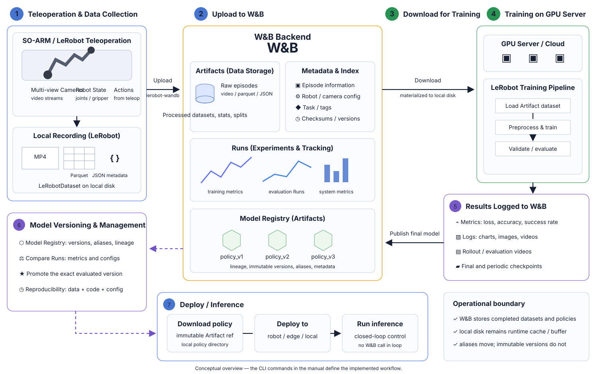
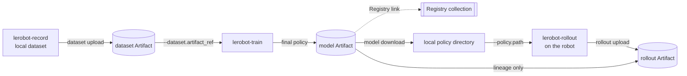

# W&B-native LeRobot pipeline (SO-101)



[English] · [日本語マニュアル](./README.ja.md)

Record on a real robot, publish the dataset, train from that exact dataset version, publish the
trained policy, roll it out on the robot, and publish the rollout with a lineage edge back to the
model that produced it — with W&B as the only remote store.

The diagram is a conceptual overview. The commands and runtime boundaries below are the
authoritative interface for this fork. In particular, W&B is never called from the robot control
loop.

The commands form a tested template. Supply the setup and runtime values explicitly marked in steps
0, 4, and 6, and adjust the hardware ports and camera index described in step 0.
`tests/integrations/wandb_artifacts/test_showcase_readme.py` expands the documented values, extracts
the commands, and parses them against the real CLI. It does not exercise a live W&B workspace or
robot hardware.

## Pipeline



Solid arrows move bytes. The Registry link and the policy-to-rollout lineage edge do not.

## What this example is and is not

- **W&B is the only remote store here.** Nothing in this example pushes to the Hugging Face Hub.
- **Local disk remains the runtime cache and recording buffer.** Artifacts are materialized before
  LeRobot reads them; the robot does not use W&B as a filesystem.
- **No W&B call happens inside the robot control loop.** Publishing is a separate operation after
  recording or rollout.
- **Aliases are mutable; versions are immutable.** `latest` and `candidate` can move; `v3` cannot.
- **Training records the immutable dataset version it actually used.** Passing an alias does not
  weaken the recorded lineage.
- **A candidate or Registry link is not production approval.** Applying `production` to the exact
  evaluated version is the deliberate promotion step.
- **Rollout success counts are supplied by the operator.** This workflow does not score physical
  success automatically.

## 0. Prerequisites

Run this from the root of a clone of this fork. Replace `your-wandb-entity` with the W&B entity that
owns the project.

```bash
uv sync --locked --extra core_scripts --extra feetech --extra training
source .venv/bin/activate
wandb login
export WANDB_ENTITY="your-wandb-entity"
export WANDB_PROJECT="so101-pick-cube"
```

`core_scripts` installs the dataset and hardware stacks, `feetech` the SO-101 motor bus, and
`training` both `wandb` and `accelerate`. The commands below assume an SO-101 follower on
`/dev/ttyACM0`, a leader on `/dev/ttyACM1`, and an OpenCV camera at index `0`; adjust them to your
hardware.

## 1. Record a teaching dataset

This is standard LeRobot recording. W&B is not involved yet.

```bash
lerobot-record \
  --robot.type=so101_follower --robot.port=/dev/ttyACM0 --robot.id=my_follower \
  --teleop.type=so101_leader --teleop.port=/dev/ttyACM1 --teleop.id=my_leader \
  --robot.cameras="{ front: {type: opencv, index_or_path: 0, width: 640, height: 480, fps: 30}}" \
  --dataset.repo_id=local/pick-cube \
  --dataset.root=./data/pick-cube \
  --dataset.single_task="Pick up the cube and place it in the bin" \
  --dataset.num_episodes=30 \
  --dataset.push_to_hub=false
```

## 2. Publish the dataset as an Artifact

The local directory is validated before a W&B Run is created: metadata must parse, Parquet must
match the declared schema, referenced videos must exist, and indices must agree.

```bash
lerobot-wandb dataset upload \
  --root ./data/pick-cube \
  --entity "$WANDB_ENTITY" \
  --project "$WANDB_PROJECT" \
  --name pick-cube \
  --alias raw
```

The command prints an immutable resolved reference such as
`your-wandb-entity/so101-pick-cube/pick-cube:v0`. W&B records that resolved version when training
starts, even though the next command requests the mutable `raw` alias.

## 3. Train directly from the Artifact

Exactly one of `dataset.repo_id` and `dataset.artifact_ref` may be set. The Artifact is downloaded
under `output_dir` before the dataset object is built.

```bash
lerobot-train \
  --dataset.artifact_ref="$WANDB_ENTITY/$WANDB_PROJECT/pick-cube:raw" \
  --policy.type=act \
  --policy.device=cuda \
  --output_dir=outputs/train/act_pick_cube \
  --job_name=act_pick_cube \
  --batch_size=8 \
  --steps=100000 \
  --wandb.enable=true \
  --wandb.project="$WANDB_PROJECT" \
  --wandb.entity="$WANDB_ENTITY" \
  --wandb.model_artifact_name=pick-cube-policy \
  --wandb.model_artifact_aliases='["candidate"]' \
  --wandb.registered_model_name=pick-cube-policy \
  --policy.push_to_hub=false
```

`wandb.model_artifact_name` publishes the final checkpoint as a versioned model Artifact.
`wandb.registered_model_name` additionally links a deployable final policy into the Registry
collection `wandb-registry-model/pick-cube-policy`.

Resume with the saved config, not `output_dir` alone:

```bash
lerobot-train --resume=true \
  --config_path=outputs/train/act_pick_cube/checkpoints/last/pretrained_model/train_config.json
```

The already-materialized dataset is reused and its identity is checked against the download
sidecar.

> **PEFT/LoRA:** an adapter-only checkpoint may be uploaded, but it is not linked into the Registry
> because it cannot be loaded as a standalone policy. Publish a merged checkpoint for deployment.

## 4. Fetch the trained policy on the robot machine

The download is staged, validated as a loadable policy checkpoint, and only then moved to `root`.

```bash
lerobot-wandb model download \
  --ref "$WANDB_ENTITY/$WANDB_PROJECT/pick-cube-policy:candidate" \
  --root ./policies/pick-cube-candidate
```

Copy the full immutable resolved reference printed by the command into `MODEL_REF`. Replace the
example; do not infer a version number from the alias.

```bash
export MODEL_REF="your-wandb-entity/so101-pick-cube/pick-cube-policy:v0"
```

`candidate` may move later. `MODEL_REF` must continue to identify the policy that was actually
downloaded and run.

## 5. Roll out on the real robot

This is standard `lerobot-rollout` and is offline with respect to W&B.

```bash
lerobot-rollout \
  --strategy.type=episodic \
  --policy.path=./policies/pick-cube-candidate \
  --robot.type=so101_follower --robot.port=/dev/ttyACM0 --robot.id=my_follower \
  --teleop.type=so101_leader --teleop.port=/dev/ttyACM1 --teleop.id=my_leader \
  --dataset.repo_id=local/rollout_pick-cube \
  --dataset.root=./data/rollout-pick-cube \
  --dataset.num_episodes=20 \
  --dataset.single_task="Pick up the cube and place it in the bin" \
  --dataset.push_to_hub=false
```

Count successful episodes while the rollout runs.

## 6. Publish the rollout with policy lineage

Disconnect the robot first. Set `EPISODES_SUCCEEDED` to the observed count; `14` is only an example
for a 20-episode rollout.

```bash
export EPISODES_SUCCEEDED="14"

lerobot-wandb rollout upload \
  --root ./data/rollout-pick-cube \
  --entity "$WANDB_ENTITY" \
  --project "$WANDB_PROJECT" \
  --name pick-cube-rollout \
  --model-ref "$MODEL_REF" \
  --episodes-succeeded "$EPISODES_SUCCEEDED"
```

Use the immutable `MODEL_REF`, not `candidate`. Resolving the alias again at upload time could attach
the rollout to a different policy than the robot used.

The upload Run records the policy as an input lineage edge without downloading it and publishes the
rollout as a distinct `rollout` Artifact. It logs episode count, success count and rate, frame count,
duration, requested and resolved policy references, and one deterministic representative video.
The complete rollout remains in the Artifact.

## 7. Promote what worked

Promote the exact version evaluated by the rollout. Do not re-upload the downloaded directory,
because that would create a new version with no lineage edge to the evaluation.

```bash
lerobot-wandb model promote \
  --ref "$MODEL_REF" \
  --alias production \
  --registry-collection pick-cube-policy
```

`model promote` moves aliases and Registry links without uploading model bytes. Non-model Artifacts,
periodic weight-only checkpoints, and adapter-only policies are refused as deployable Registry
entries.

## Where things live afterwards

| Thing                     | Where                                                   |
| ------------------------- | ------------------------------------------------------- |
| Teaching dataset          | `dataset` Artifact, `pick-cube`                         |
| Trained policy            | `model` Artifact, `pick-cube-policy` plus Registry link |
| Rollout episodes          | `rollout` Artifact, `pick-cube-rollout`                 |
| Dataset-to-policy lineage | training Run config and model Artifact metadata         |
| Policy-to-rollout lineage | rollout Run input edge and rollout Artifact metadata    |
